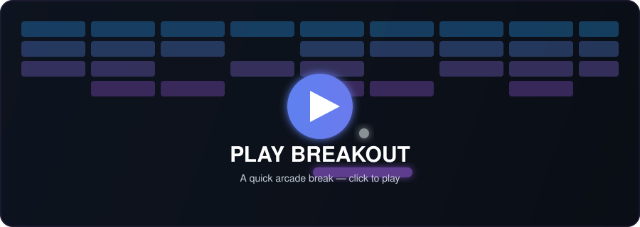
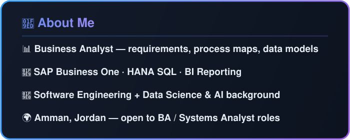
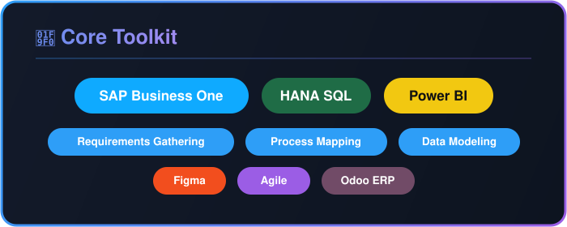
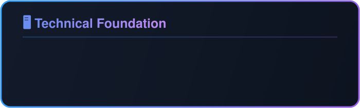

  

  
  &nbsp;&nbsp;
  
  &nbsp;&nbsp;
  
  

  

  

  

  

  

  

  

  

  

  <picture>
    <source media="(prefers-color-scheme: dark)" srcset="https://raw.githubusercontent.com/Alghussein4/Alghussein4/output/github-contribution-grid-snake-dark.svg" />
    <source media="(prefers-color-scheme: light)" srcset="https://raw.githubusercontent.com/Alghussein4/Alghussein4/output/github-contribution-grid-snake.svg" />
    
  </picture>

  

### 📊 GitHub Metrics

  

  

  

  
     
  

  

  <a href="https://www.linkedin.com/in/abdulrahman-alghussein-41864a211/">LinkedIn</a> ·
  <a href="https://mail.google.com/mail/?view=cm&fs=1&to=alghussein4@gmail.com">alghussein4@gmail.com</a> ·
  📍 Amman, Jordan

